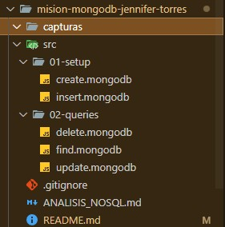
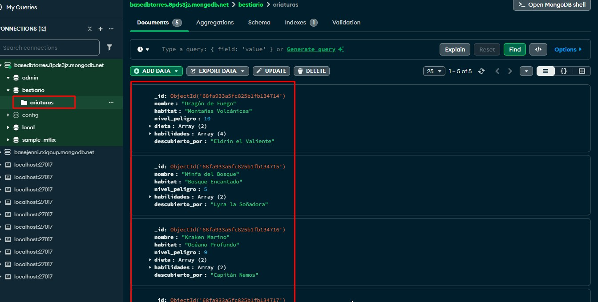
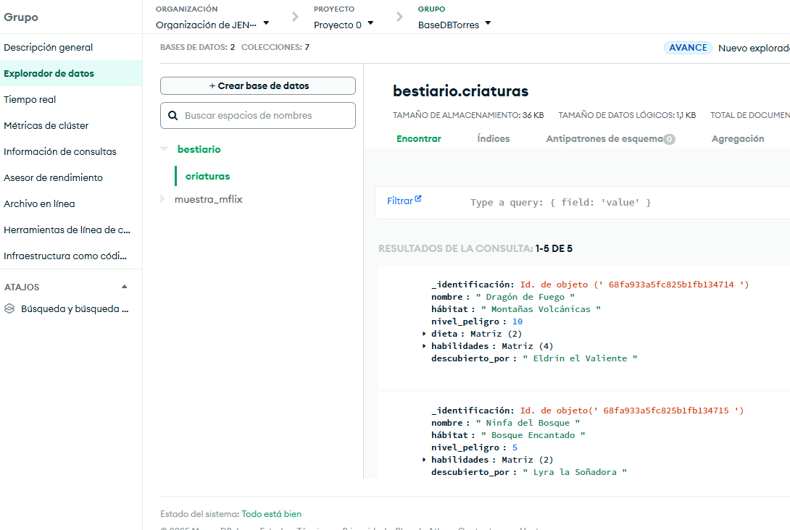

#  Misión MongoDB: El Bestiario Digital

## Nombre: Jennifer Torres

Este proyecto es un **registro de criaturas fantásticas** usando **MongoDB**, ideal para aprender operaciones CRUD y análisis de bases de datos NoSQL. La base de datos permite almacenar información diversa de cada criatura, como habilidades, hábitat y nivel de peligro.

>  Este proyecto sirve como práctica profesional de MongoDB, combinando scripts, consultas y análisis.

---

##  Estructura del Proyecto

- `misiones_mongodb.js` → Script con todas las operaciones CRUD.
- `ANALISIS_NOSQL.md` → Reflexión sobre NoSQL vs SQL y casos de estudio.
- `README.md` → Instrucciones y documentación.
- `capturas/` → Carpeta con screenshots de Compass, mongosh y resultados.



---

## Scripts y Comandos

| Comando / Acción | Descripción |
|-----------------|------------|
| `mongosh`       | Abre la terminal de MongoDB para ejecutar comandos interactivos. |
| `load('misiones_mongodb.js')` | Ejecuta automáticamente todos los comandos del script. |
| `db.criaturas.find()` | Muestra todas las criaturas en la colección. |
| `db.criaturas.updateOne()` | Actualiza un documento específico (ej: agregar habilidades). |
| `db.criaturas.updateMany()` | Actualiza múltiples documentos según un criterio (ej: incrementar nivel de peligro). |

---

##  Tecnologías utilizadas

| Herramienta | Propósito |
|-------------|-----------|
| MongoDB     | Base de datos NoSQL orientada a documentos. |
| MongoDB Compass | Interfaz gráfica para visualizar y manipular datos. |
| mongosh     | Consola interactiva de MongoDB para ejecutar scripts y consultas. |
| VS Code (opcional) | Para editar scripts con la extensión MongoDB. |

---

##  Configuración rápida

### 1. Clonar el repositorio
```bash
git clone https://github.com/Jntorres2001/mision-mongodb-jennifer.git
cd mision-mongodb-jennifer
```
## Capturas de pantalla


---


---
## Análisis NoSQL
- NoSQL vs SQL: MongoDB permite flexibilidad de esquema, ideal para criaturas con atributos variados, a diferencia de un modelo relacional rígido.

- Tipos de NoSQL: Clave-Valor, Columnar, Grafo; útiles en escenarios específicos como mensajería rápida o redes sociales.

- Casos de estudio: Netflix y Amazon usan MongoDB para catálogos con datos heterogéneos y consultas rápidas.
------


#  Misión 2 - Validación con JSON Schema

En esta misión se implementan validaciones a nivel de base de datos
para las colecciones `guardianes` y `criaturas` del bestiario.

- Se aplican restricciones con JSON Schema.
- Se modelan relaciones 1-1 (ficha veterinaria embebida)
  y 1-N (criaturas referenciadas con guardianes).
- Se incluyen pruebas de inserciones válidas e inválidas.

## 1. Validación de datos a nivel de Base de Datos

* Implementar la validación directamente en la base de datos (con JSON Schema) es mejor que hacerlo solo en el backend porque:
* Protege los datos desde la fuente: evita que se guarden datos erróneos incluso si el código de la aplicación tiene fallos.
* Mantiene la integridad: todas las aplicaciones que usen la base (no solo una API) estarán obligadas a cumplir las mismas reglas.
* Reduce errores humanos: no depende del programador que siempre valide correctamente.
* Aumenta la seguridad y consistencia de la información en la base de datos.
* En resumen, la base de datos se vuelve un “guardían de integridad” que protege los datos sin importar desde dónde se insertan.

## 2. Relación 1 a 1 – Ficha Veterinaria Embebida

Se eligió modelar la ficha_veterinaria como un documento embebido dentro de la colección criaturas porque:

* Cada criatura solo tiene una ficha veterinaria.
* La información de la ficha solo tiene sentido junto con la criatura, no por separado.
* Facilita la lectura, ya que no hay que hacer búsquedas adicionales para mostrar los datos veterinarios.
Se preferiría una relación referenciada (en otra colección) si:
* Las fichas se gestionaran de forma independiente.
* O si una ficha veterinaria pudiera pertenecer a varias criaturas (por ejemplo, un historial médico compartido).

## 3. Relaciones 1 a N
🔹Guardián → Inventario (Embebida)

El inventario se modeló dentro del documento del guardián porque:
* Es información pequeña y directamente relacionada.
* No se necesita consultar los ítems por separado.
* Se accede fácilmente a todo el inventario sin hacer joins ni referencias.

Esto mejora el rendimiento en consultas simples y mantiene la estructura compacta.

🔹 Guardián → Criaturas (Referenciada)
* En cambio, la relación entre guardianes y criaturas se modeló referenciada (con id_guardian) porque:
* Un guardián puede tener muchas criaturas, y guardarlas dentro del mismo documento haría que creciera demasiado.
* Las criaturas se consultan y actualizan de forma independiente.
* Permite escalar mejor, mantener consistencia y evitar duplicación de datos.

## Conclusión 
La validación con JSON Schema y el diseño adecuado de relaciones (embebidas y referenciadas) ayudan a que el bestiario sea más sólido, confiable y fácil de mantener.
Con estas reglas, cada colección actúa como un módulo seguro, evitando datos corruptos y garantizando coherencia entre guardianes y criaturas.